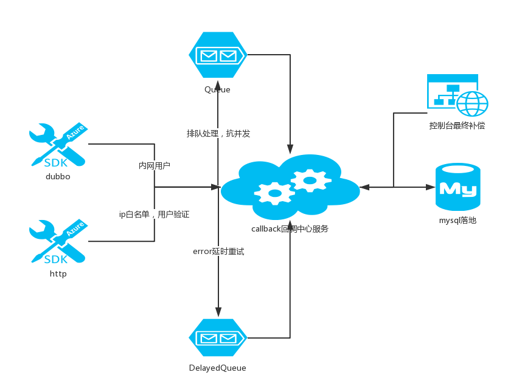
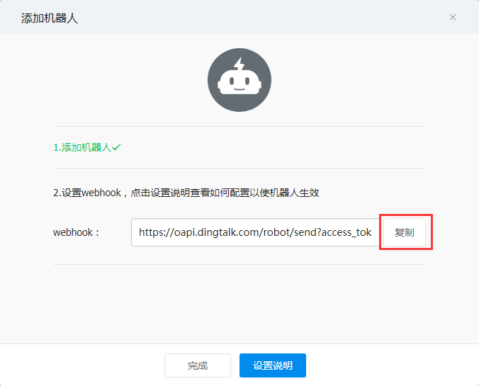
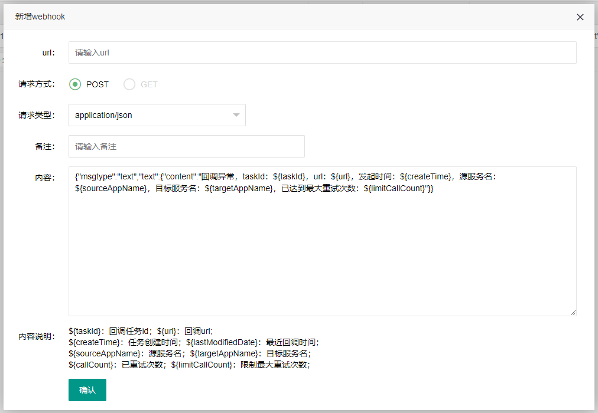

# kkbida(必达) 消息通知
## 使用场景
解决异构系统间消息通知时保证消息必达，常见于系统回调，消息异步通知等场景，提供了失败重试，错误通知，最终手动补偿，web端管理等功能

## 外部依赖
准备一个mysql和redis

mysql新建一个数据库callcenterdb

分别配置kk-callcenter-main模块中的 application.properties 配置文件的```spring.datasource``` 及 ```spring.redis``` 开头的配置即可

## 快速开始
从github拉取代码
```
git clone https://github.com/kekingcn/kkbida
```
使用maven构建
```
cd kkbida
mvn clean install -DskipTests
```
运行
```
cd kkbida/kk-callcenter-main/target
java -jar kk-callcenter-main-1.0.1.jar
```
浏览器访问 http://127.0.0.1:8080 即可 用户名/密码：admin/admin


## 注意事项
此项目使用了凯京科技另一个开源组件klock( https://gitee.com/kekingcn/spring-boot-klock-starter ) 

maven依赖
```xml
<dependency>
    <groupId>cn.keking</groupId>
    <artifactId>spring-boot-klock-starter</artifactId>
    <version>1.3-RELEASE</version>
</dependency>
```

## 系统架构
通过阻塞队列来抗并发，通过延迟队列来处理失败的消息，并辅以控制台手动处理消息来保证消息最终送达。在使用方面，考虑到最小化改造和易用性，提供dubbo和http的sdk客户端

## 架构拓扑

## SDK使用方法
### maven引入sdk
```
<dependency>
    <groupId>cn.keking.callcenter</groupId>
    <artifactId>kk-callcenter-sdk</artifactId>
    <version>1.0.1</version>
</dependency>
```
### 获取CallBackService对象
#### dubbo方式
```
@Reference(version = "1.0")
private CallBackService callBackService;
    
```

#### http方式

推荐获取方式如下(也可以直接new)
ps：如果通过http客户端sdk调用，需要先申请配置白名单
```
@Value("${callBack.BaseUrl}")
private String callBackBaseUrl; //回调中心http调用url
@Value("${callBack.UserName}") 
private String callBackUserName; //回调中心帐号
@Value("${callBack.PassWord}")
private String callBackPassWord; //回调中心密码

@Bean
public CallBackService callBackService(){
    CallBackServiceHttpImpl callBackServiceHttp = new CallBackServiceHttpImpl(callBackBaseUrl,callBackUserName,callBackPassWord);
    return callBackServiceHttp;
}

@Autowired
private CallBackService callBackService;
```

### 调用CallBackService发起回调
```
Map<String, Object> paramMap = new HashMap<>();
paramMap.put("city", "上海");

CallBackTask task= new CallBackTask();
task.setUrl("https://www.apiopen.top/weatherApi"); //回调url（必填）
task.setRequestMethod(RequestMethodEnum.GET); //请求方式（必填）
task.setLimitCallCount(3); //重试次数限制（必填）
task.setExpectResult("成功"); //期待返回结果（必填），用于验证回调是否成功
task.setSourceAppName("xxx"); //发起发应用名（选填）
task.setTargetAppName("yyy"); //目标方应用名（选填）
task.setRequestParam(paramMap); //调用参数(选填)
String result = callBackService.call(task);
```
### 回调发起返回结果说明
调用callBackService.call(task)发起成功则返回一个uuid为taskId，后续可以通过这个taskId查询回调任务详情，示例:'3e41bc91-0707-4b3a-a562-3aec4ed35815';  发起失败会抛出CallBackException异常

## 回调失败通知

当回调发起失败次数达到重试限制次数，回调中心会触发webhook发起失败通知

### 添加webhook钉钉通知操作
详情见：https://open-doc.dingtalk.com/docs/doc.htm?treeId=257&articleId=105735&docType=1
钉钉群添加自定义群机器人


复制webhook地址



进入后台管理页面，点击```失败通知管理```菜单，点击```新增webhook```在弹出的表单url中粘贴刚刚复制的webhook地址，填入备注保存即可



### 添加webhook企业微信通知操作
请参考：https://work.weixin.qq.com/api/doc#90000/90135/90236

### 联系我们
> 我们会用心回答解决大家在项目使用中的问题，也请大家在提问前至少Google或baidu过，珍爱生命远离无效的交流沟通


QQ群号：613025121
